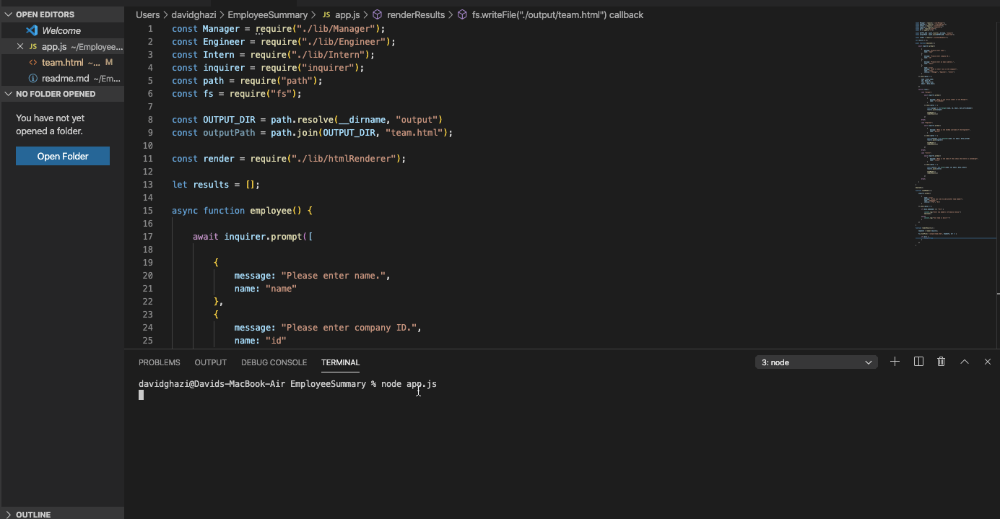

# Unit 10 OOP Homework: Template Engine - Employee Summary

## Description

You will build a software engineering team generator command line application. The application will prompt the user for information about the team manager and then information about the team members. The user can input any number of team members, and they may be a mix of engineers and interns. This assignment must also pass all unit tests. When the user has completed building the team, the application will create an HTML file that displays a nicely formatted team roster based on the information provided by the user.

## User Story

    AS A manager
    I WANT to generate a webpage that displays my team's basic info
    SO THAT I have quick access to emails and GitHub profiles

## Criteria

    GIVEN manager has a team with information assigned to each individual member

    WHEN prompted with a series of questions
    THEN the user is required to enter all correlating information
    WHEN the user is done filling out the information
    THEN a team HTML file is generated with all the information gathered from the prompts
    
## Requirements

- Functional application
- GitHub repository with a unique name and a README describing project.
- User can use the CLI to generate an HTML page that displays information about their team.
- All tests must pass

## Classes

The project must have the these classes: Employee, Manager, Engineer, Intern. The tests for these classes in the tests directory must all pass. 

The first class is an Employee parent class with the following properties and methods:

- name
- id
- email
- getName()
- getId()
- getEmail()
- getRole() // Returns 'Employee'

The other three classes will extend Employee.

In addition to Employee's properties and methods, Manager will also have:

- officeNumber
- getRole() // Overridden to return 'Manager'

In addition to Employee's properties and methods, Engineer will also have:

- github  // GitHub username
- getGithub()
- getRole() // Overridden to return 'Engineer'

In addition to Employee's properties and methods, Intern will also have:

- school
- getSchool()
- getRole() // Overridden to return 'Intern'

## Roster output

The project must generate a team.html page in the output directory, that displays a nicely formatted team roster. Each team member should display the following in no particular order:

- Name
- Role
- ID
- Role-specific property (School, link to GitHub profile, or office number)

## Preview

